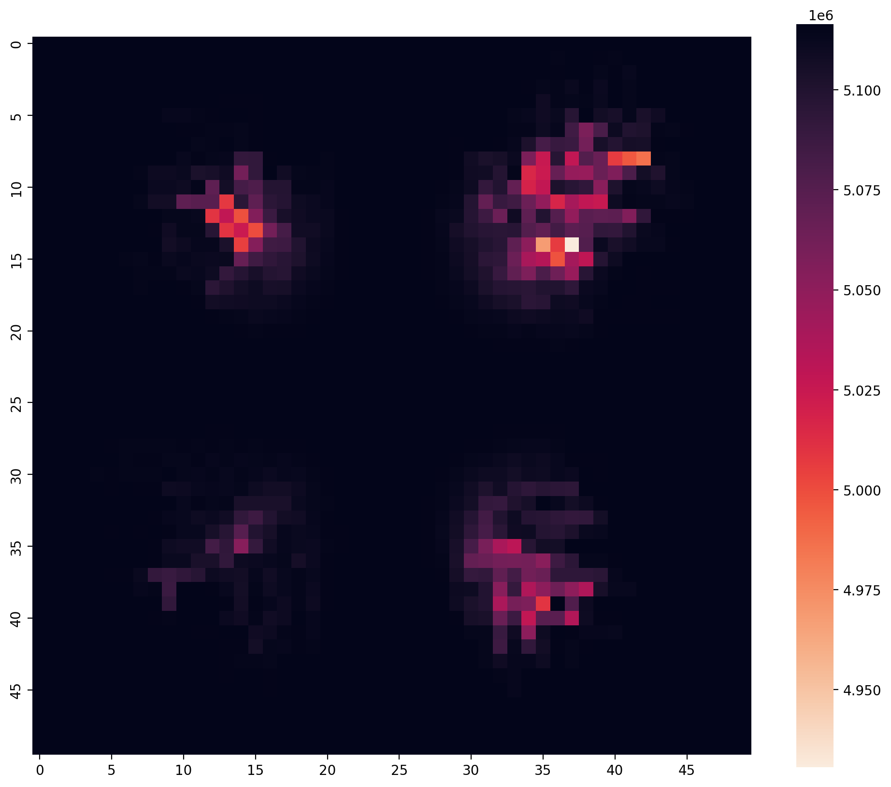

# bio-inspired-intelligence-sim
A bio-inspired neural simulator built in Python using OOP and BFS algorithms to model emergent signal propagation and energy dynamics in a 2D grid.
# Bio-Inspired Neural Signal Simulator

## 🚀 Project Overview
This project is a high-performance simulation of neural signal propagation within a 2D grid. It models how "emergent intelligence" can arise from simple local rules, using an energy-aware Breadth-First Search (BFS) algorithm.

## 🛠️ Engineering Highlights
* **Object-Oriented Design:** Individual neurons manage their own state (thresholds, energy, and cooldowns).
* **State Management:** Implemented a global "Event ID" system to prevent signal loops and ensure one-way propagation.
* **Performance Optimization:** Utilized NumPy for state tracking and a "last-update" map to calculate passive energy recovery efficiently.

## 📊 Visualizing Neural Waves

*Above: A heatmap demonstrating energy depletion (darker areas) and recovery following a central stimulus.*

## ⚙️ How to Run
1. Clone the repo: `git clone https://github.com/abdul-rehman-ai-dev/bio-inspired-intelligence-sim.git`
2. Install dependencies: `pip install -r requirements.txt`
3. Execute: `python simulator.py`
